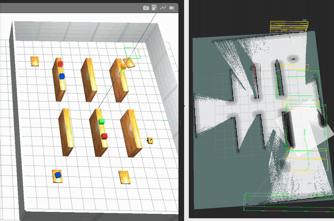

# ros2_amr_stack

**Full-stack autonomous mobile robot demo for warehouse environments**



*Left: the simulated warehouse with the AMR driving among the racks, LiDAR returns visible. Right: the
occupancy map built online with slam_toolbox — the same racks, now obstacles in the grid.*

## Overview

A ROS 2 Humble project demonstrating a complete perception, SLAM, and navigation pipeline for an autonomous mobile robot (AMR) operating in a simulated warehouse. The system processes raw 3D LiDAR and RGB-D camera data through a multi-stage perception pipeline, builds a map with SLAM, and navigates autonomously using Nav2.

**Key capabilities:**

- 3D LiDAR point cloud filtering (C++/PCL) and Euclidean clustering (Open3D)
- RGB-D camera object detection with YOLOv8
- Multi-sensor fusion combining LiDAR + camera detections
- Multi-object tracking with velocity estimation
- Online SLAM via slam_toolbox (mapping and localization modes)
- Autonomous navigation with Nav2 and SMAC Hybrid-A* planner

**Tech stack:** ROS 2 Humble, Gazebo Classic, PCL (C++), Open3D, YOLOv8, slam_toolbox, Nav2

## Architecture

```
                         +-------------------+
                         |   Velodyne VLP-16  |
                         |  /velodyne_points  |
                         +---------+---------+
                                   |
                                   v
                    +-----------------------------+
                    |  pointcloud_filter (C++/PCL) |
                    |  Voxel -> Range -> Ground    |
                    |  -> Outlier removal          |
                    +------+----------------+------+
                           |                |
                   /cloud_filtered    /cloud_ground
                           |
              +------------+-------------+
              |                          |
              v                          v
  +-----------------------+   +------------------------+
  |  obstacle_detector    |   | pointcloud_to_laserscan|
  |  Open3D DBSCAN +      |   |  3D -> 2D scan         |
  |  geometric classify   |   +-----------+------------+
  +-----------+-----------+               |
              |                    /scan_2d
              |                           |
              v                           v
  +-----------------------+   +------------------------+
  |   sensor_fusion       |   |   slam_toolbox         |
  |   LiDAR + Camera      |   |   Mapping / Localization|
  +-----------+-----------+   +-----------+------------+
              |                           |
              v                      /map + /tf
  +-----------------------+               |
  |   object_tracker      |               v
  |   Multi-object track  |   +------------------------+
  +-----------+-----------+   |   Nav2 Navigation      |
              |               |   SMAC Hybrid-A*       |
              v               |   DWB Controller       |
  +-----------------------+   +------------------------+
  |   perception_viz      |
  |   RViz markers        |
  +-----------------------+

  +-----------------------+
  |  RealSense D435       |
  |  /camera/image_raw    |
  +---------+-------------+
            |
            v
  +-----------------------+
  |  camera_detector      |
  |  YOLOv8 inference     |
  +-----------+-----------+
              |
              +-------> sensor_fusion (above)
```

**Sensor setup:** The AMR platform is a differential-drive robot with a Velodyne VLP-16 3D LiDAR mounted on top and an Intel RealSense D435 depth camera facing forward. An IMU provides orientation data for the odometry pipeline.

## Project Structure

```
ros2_amr_stack/
+-- .github/workflows/ci.yml    # GitHub Actions CI (build, lint, test)
+-- docker/
|   +-- Dockerfile               # Multi-stage build (ROS Humble + deps)
|   +-- docker-compose.yml       # GPU-accelerated development environment
|   +-- entrypoint.sh            # Container entrypoint (sources workspace)
+-- scripts/
|   +-- benchmark_perception.py  # Offline perception pipeline benchmark
|   +-- teleop.sh                # Keyboard teleop launcher
+-- test/
|   +-- test_obstacle_detector.py   # Unit tests for obstacle detection
|   +-- test_sensor_fusion.py       # Unit tests for sensor fusion
|   +-- test_object_tracker.py      # Unit tests for object tracking
+-- src/
    +-- amr_pointcloud_filter/   # C++ PCL point cloud filtering node
    +-- amr_perception/          # Python perception pipeline
    |   +-- nodes/
    |       +-- obstacle_detector/   # 3D LiDAR obstacle detection
    |       +-- camera_detector/     # RGB-D YOLOv8 detection
    |       +-- sensor_fusion/       # Multi-sensor fusion
    |       +-- object_tracker/      # Multi-object tracking
    |       +-- perception_viz/      # RViz visualization
    +-- amr_slam/                # SLAM configuration and launch files
    +-- amr_navigation/          # Nav2 configuration and launch files
    +-- amr_description/         # URDF/xacro robot model
    +-- warehouse_world/         # Gazebo warehouse environment
    +-- amr_bringup/             # Top-level bringup launch files
```

## Quick Start

```bash
# Clone
git clone https://github.com/jwl-robotics/ros2-amr-stack.git && cd ros2-amr-stack

# Build and run with Docker
cp .env.example .env
docker compose -f docker/docker-compose.yml build
docker compose -f docker/docker-compose.yml up -d
docker compose -f docker/docker-compose.yml exec amr bash

# Inside container
colcon build --symlink-install
source install/setup.bash

# Launch full stack
ros2 launch amr_bringup full_stack.launch.py

# Or launch individual components
ros2 launch amr_bringup simulation.launch.py
ros2 launch amr_bringup perception.launch.py
ros2 launch amr_bringup slam.launch.py
```

## Packages

| Package | Language | Description |
|---|---|---|
| `amr_pointcloud_filter` | C++ | Multi-stage PCL pipeline: voxel downsample, range gate, RANSAC ground removal, statistical outlier removal |
| `amr_perception` | Python | Perception nodes: obstacle detection, camera detection, sensor fusion, object tracking, visualization |
| `amr_slam` | Python | slam_toolbox configuration for warehouse mapping and localization modes |
| `amr_navigation` | Python | Nav2 configuration with SMAC Hybrid-A* planner and costmap setup |
| `amr_description` | URDF/xacro | Differential-drive robot model with Velodyne VLP-16, RealSense D435, and IMU |
| `warehouse_world` | SDF/Gazebo | Simulated warehouse environment with shelving, pallets, and open floor space |
| `amr_bringup` | Python | Top-level launch files that compose the full stack |

## Robot Model

The AMR is a differential-drive robot with the following components (as seen in Gazebo):

| Part | Visual | Description |
|---|---|---|
| Chassis | Dark black box | Main body (0.6 x 0.4 x 0.15 m) |
| Top plate | Orange plate | Cover on top of the chassis |
| Front bumper | Orange bar | Indicates forward direction |
| Drive wheels | Black discs (sides) | 2 powered wheels for differential drive |
| Caster wheels | Grey balls (front/rear) | 2 passive casters for stability |
| Sensor tower | Black cylinder | Raises the LiDAR above the chassis |
| Velodyne VLP-16 | Blue cylinder (top) | 16-channel 3D LiDAR, 360 deg, 10 Hz |
| RealSense D435 | Small silver box (front) | RGB-D depth camera, 640x480, 30 Hz |
| IMU | (hidden inside chassis) | 100 Hz orientation and acceleration |

## Visualization

Multiple tools are available for inspecting the running system:

**RViz2** -- Full 3D visualization. View point clouds, robot model, TF frames, maps, markers, laser scans, camera feeds, and costmaps overlaid in 3D space.

```bash
# In a separate container terminal
rviz2
# Add displays: /velodyne_points (PointCloud2), /camera/image_raw (Image),
#   RobotModel, TF. Set Fixed Frame to "odom" or "base_link".
```

**rqt_image_view** -- Lightweight single-topic camera viewer.

```bash
ros2 run rqt_image_view rqt_image_view
# Select /camera/image_raw from the dropdown
```

**Teleop** -- Drive the robot with keyboard controls.

```bash
ros2 run teleop_twist_keyboard teleop_twist_keyboard --ros-args -r cmd_vel:=/cmd_vel
# i=forward, ,=backward, j=turn left, l=turn right, k=stop
# q/z=increase/decrease speed
```

## Perception Pipeline

The robot has two complementary sensors: a **Velodyne VLP-16 3D LiDAR** (360-degree coverage, accurate geometry, no color) and an **Intel RealSense D435 RGB-D camera** (forward-facing only, color + depth, enables object recognition via YOLOv8). The LiDAR detects obstacles in all directions using point cloud clustering, while the camera identifies specific object classes in its field of view. Sensor fusion merges detections from both sensors -- objects seen by both get higher confidence, especially when both agree on the class label. The fused detections are then tracked frame-to-frame with persistent IDs and velocity estimation.

The pipeline runs five interconnected nodes:

### Obstacle Detector (`obstacle_detector_node`)

Subscribes to the filtered point cloud (`/cloud_filtered`) and performs:

1. **Binary parsing** -- Converts PointCloud2 messages to numpy arrays using `struct` (no PCL Python dependency).
2. **DBSCAN clustering** -- Uses Open3D's `cluster_dbscan` for Euclidean clustering. Open3D was chosen over scikit-learn because it operates directly on 3D point clouds with optimized KD-tree internals, and avoids pulling in the full scipy stack.
3. **Geometric classification** -- Classifies each cluster's axis-aligned bounding box into one of four warehouse-relevant categories: `person`, `shelf`, `pallet`, or `obstacle`. This rule-based approach was chosen to avoid training-data requirements while still providing semantically meaningful labels for the planner. The thresholds are fully parameterized via ROS 2 parameters.
4. **Publishing** -- Outputs `vision_msgs/Detection3DArray` for downstream fusion and `visualization_msgs/MarkerArray` wireframe bounding boxes for RViz.

### Camera Detector (`camera_detector_node`)

Runs YOLOv8 inference on RGB frames from the RealSense D435. Detected 2D bounding boxes are back-projected to 3D using the aligned depth image, producing `Detection3D` messages in the camera frame.

### Sensor Fusion (`sensor_fusion_node`)

Performs greedy nearest-neighbour association between LiDAR and camera detections within a configurable distance threshold. Matched pairs are merged using weighted confidence averaging, with a bonus applied when both sensors agree on the class label.

### Object Tracker (`object_tracker_node`)

A frame-by-frame multi-object tracker using nearest-neighbour association and a constant-velocity motion model. Tracks must accumulate a configurable number of consecutive hits (`min_hits`) before they are promoted to confirmed status. Tracks not updated for `max_lost_frames` frames are pruned.

### Perception Viz (`perception_viz_node`)

Consolidates all perception outputs into RViz-ready marker arrays with colour-coded bounding boxes, track IDs, and velocity vectors.

## C++ Point Cloud Filter

The `amr_pointcloud_filter` package implements a high-performance PCL processing pipeline in C++:

| Stage | Algorithm | Purpose |
|---|---|---|
| 1. Voxel downsample | `pcl::VoxelGrid` | Reduce point density uniformly (default leaf size: 3 cm) |
| 2. Range gate | Manual loop | Remove points outside [0.3 m, 50 m] to discard self-returns and distant noise |
| 3. Ground removal | `pcl::SACSegmentation` (RANSAC) | Segment and separate the ground plane from obstacles |
| 4. Outlier removal | `pcl::StatisticalOutlierRemoval` | Remove sparse noise points |

Each stage can be independently enabled/disabled via ROS 2 parameters. The node publishes both the filtered (obstacle) cloud on `/cloud_filtered` and the extracted ground plane on `/cloud_ground`.

**Performance:** The pipeline processes a typical 30,000-point VLP-16 scan in under 15 ms on a modern CPU, well within the 100 ms budget for a 10 Hz LiDAR.

## SLAM

The `amr_slam` package wraps `slam_toolbox` with parameters tuned for warehouse environments:

- **Mapping mode** (`slam_mapping.launch.py`): Runs `async_slam_toolbox_node` for online map building. A `pointcloud_to_laserscan` node first projects the filtered 3D cloud into a 2D laser scan, since slam_toolbox operates on 2D scans.
- **Localization mode** (`slam_localization.launch.py`): Runs `localization_slam_toolbox_node` against a previously serialized pose-graph map.

Key tuning for warehouse environments:
- Aggressive loop closure (`do_loop_closing: true`) to handle the repetitive geometry of shelf aisles.
- Tightened `minimum_travel_distance` (0.3 m) and `minimum_travel_heading` (0.3 rad) for denser scan insertion in narrow corridors.
- 5 cm map resolution -- a balance between detail and memory usage for typical 2,000-5,000 m^2 warehouse floors.

## Navigation

The `amr_navigation` package configures the Nav2 stack:

- **Global planner:** SMAC Hybrid-A* -- produces smooth, kinematically feasible paths that respect the differential-drive turning radius.
- **Local controller:** DWB (Dynamic Window-Based) for reactive obstacle avoidance.
- **Costmaps:** The global costmap uses the SLAM-generated static map inflated by the robot's inscribed radius. The local costmap adds a rolling-window obstacle layer fed by the perception pipeline.

## Testing

All tests are pure-Python unit tests that exercise the perception logic without requiring a running ROS 2 system:

```bash
# Run all tests
pytest test/ -v

# Run specific test file
pytest test/test_obstacle_detector.py -v

# Run a single test
pytest test/test_obstacle_detector.py::TestClassifyCluster::test_classify_person -v
```

The tests cover:
- **Obstacle detector:** PointCloud2 binary parsing, geometric classification rules, DBSCAN clustering behaviour
- **Sensor fusion:** Detection association (matched/unmatched), confidence merging, class agreement/disagreement handling
- **Object tracker:** Track creation, association, lifecycle (confirmation and loss), velocity estimation

### Benchmark

A standalone benchmark script measures perception pipeline throughput on synthetic data:

```bash
python3 scripts/benchmark_perception.py --num_points 50000 --iterations 100
```

## CI/CD

The GitHub Actions pipeline (`.github/workflows/ci.yml`) runs three jobs on every push and pull request to `main`:

1. **Build** -- Builds the Docker image and runs `colcon build` inside the container.
2. **Lint** -- Runs `flake8` on Python sources and `clang-format` on C++ sources.
3. **Test** -- Runs the `pytest` unit test suite covering perception logic (28 tests).

## License

MIT
